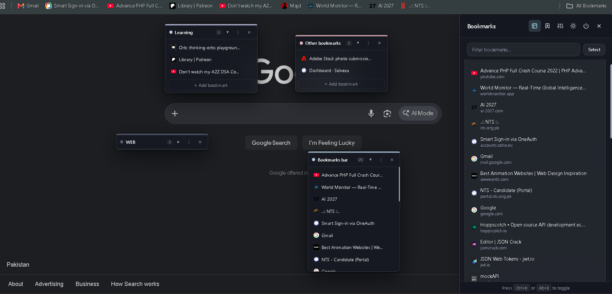

# BookmarkPanels

A modern, glassmorphic Chrome extension that organizes your bookmarks into customizable panels. Works on **any webpage** without hijacking or replacing your default New Tab page.

---

## 📸 Preview

### Floating Cards & Slide-in Glass Sidebar


### Category Actions & Context Menus


---

## ✨ What BookmarkPanels Does

- **Frosted Glass Design**: Translucent background blur, soft borders, and smooth shadows that blend seamlessly into any webpage.
- **Floating Sticky-Notes & Slide-in Sidebar**:
  - Slide-in glass sidebar accessible anytime via `Alt+B`, the toolbar icon, or the subtle right-edge tab.
  - Floating sticky cards mode (`▧`) to position bookmark panels anywhere on your screen.
- **Keeps Native Chrome / Google Tabs**: Zero interference with your default New Tab page or Google search.
- **Non-Intrusive Overlay**: Click-through layout ensures web page links, forms, and Google inputs remain 100% interactive.
- **Full Drag & Drop**: Reorder categories, move bookmarks between panels, or position floating cards freely.
- **Quick Bookmarking**: Context menu shortcut (`Right-click -> Add to BookmarkPanels`) and quick-add button in the toolbar popup.
- **Real-Time Search**: Filter bookmarks instantly across all categories.
- **One-Click Native Import**: Import existing Chrome bookmarks into structured panels with a single click.
- **Theming**: Dark and light modes with watercolor & pastel accents.

---

## 🚀 How to Load Unpacked for Testing

1. Clone or download this repository:
   ```bash
   git clone https://github.com/YOUR_USERNAME/BookmarkPanels.git
   ```
2. Open Google Chrome and navigate to:
   ```
   chrome://extensions/
   ```
3. Enable **Developer mode** using the toggle switch in the top-right corner.
4. Click the **Load unpacked** button in the top-left.
5. Select the `BookmarkPanels` root folder (containing `manifest.json`).
6. The extension is now installed! Press `Alt+B` on any webpage to open your panels.
   *(Note: To test changes after modifying code, click the **refresh icon** on the BookmarkPanels card in `chrome://extensions/`)*.

---

## ⌨️ Controls & Shortcuts

| Action | Shortcut / Control |
| :--- | :--- |
| **Toggle Glass Sidebar** | `Alt+B`, click toolbar icon, or click `☰` right edge tab |
| **Toggle Floating Cards** | Click `▧` icon in the sidebar header |
| **Close Sidebar / Modals** | `Escape` key or click outside the panel |
| **Category Actions** | Click `⋮` next to any category name |
| **Bookmark Actions** | Hover over any bookmark and click `⋮` |
| **Reorder Items** | Drag & drop categories or bookmarks |

---

## 📄 License

Distributed under the [MIT License](LICENSE). Copyright &copy; 2026 Asad. See `LICENSE` for more information.
