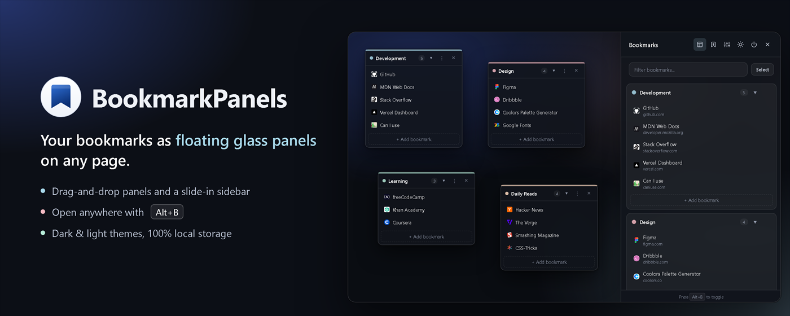
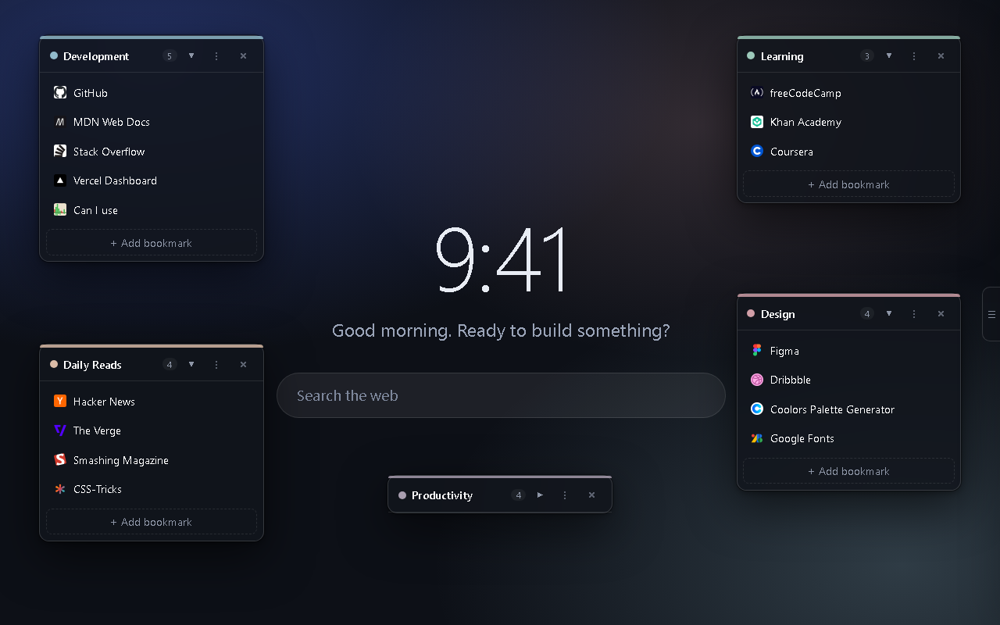
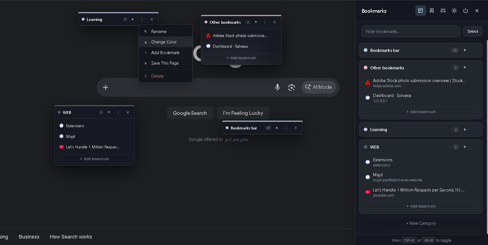
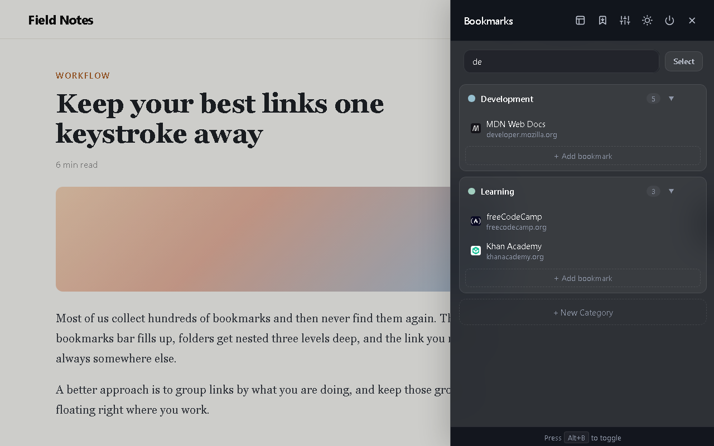
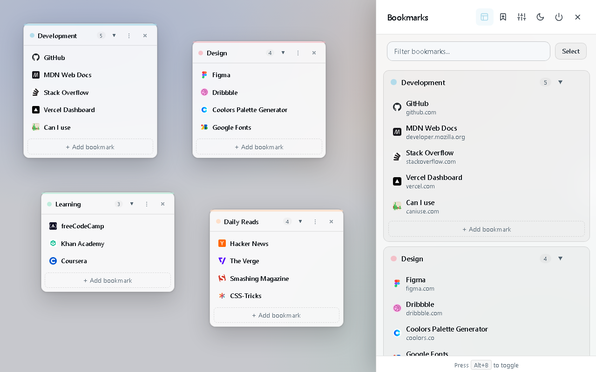

<div align="center">


# BookmarkPanels

**Your bookmarks as floating glass panels on any website. Press `Alt+B` and they're there.**

[](https://chromewebstore.google.com/detail/bookmarkpanels/gjpdnmblolkpcmnobbljeneeagfmiohf)
[](LICENSE)


[**Install from the Chrome Web Store →**](https://chromewebstore.google.com/detail/bookmarkpanels/gjpdnmblolkpcmnobbljeneeagfmiohf)



</div>

## Why

My bookmarks bar was a junk drawer. Links hidden behind `»`, folders nested three levels deep, and I'd end up Googling things I had already saved.

BookmarkPanels groups your links into small, colour-coded panels that sit on top of whatever page you're on. Open them when you need them, drag them where you want them, and close them when you don't. It doesn't replace your New Tab page or your search engine.

## Features

- **Slide-in sidebar.** Open it with `Alt+B`, the toolbar button, or the small tab on the right edge of the screen.
- **Floating panels.** Pin groups like Work, Design or Reading anywhere on the screen. Collapse or hide them per page.
- **Drag & drop.** Move bookmarks between panels and reorder the categories themselves.
- **Instant search.** Filter every bookmark as you type. No match? Press `Enter` to search the web.
- **One-click import.** Bring in your existing Chrome bookmarks. Each folder becomes a panel.
- **Auto sync.** Bookmarks you save in Chrome show up in the matching panel automatically.
- **Right-click save.** "Add to BookmarkPanels" on any page.
- **Bulk actions.** Select several bookmarks to move or delete them together.
- **Dark & light themes,** a colour per category, and adjustable glass brightness and blur.
- **Private.** Everything is stored locally in your browser. No account, no analytics, no server.

## Screenshots

| Floating panels | Works on any website |
| :---: | :---: |
|  |  |
| **Instant search** | **Light theme** |
|  |  |

## Install

**From the store (recommended):** [Chrome Web Store](https://chromewebstore.google.com/detail/bookmarkpanels/gjpdnmblolkpcmnobbljeneeagfmiohf)

**From source:**

1. Clone the repo:
   ```bash
   git clone https://github.com/Masad791/BookmarkPanels.git
   ```
2. Open `chrome://extensions` and turn on **Developer mode** (top right).
3. Click **Load unpacked** and select the `BookmarkPanels` folder (the one with `manifest.json`).
4. Open any website and press `Alt+B`.

After changing the code, click the reload icon on the extension's card in `chrome://extensions`, then refresh the page.

## Shortcuts

| Action | How |
| :--- | :--- |
| Open / close the sidebar | `Alt+B`, the toolbar button, or the right-edge tab |
| Show / hide floating panels | Panels button in the sidebar header |
| Close the sidebar or a dialog | `Esc` |
| Category or bookmark options | `⋮` next to the item |
| Reorder | Drag and drop |

You can change `Alt+B` at `chrome://extensions/shortcuts`.

## How it works

No framework, no build step, no server. Plain JavaScript on Manifest V3.

```
any website
   └─ content script ── the panels & sidebar, rendered inside a closed Shadow DOM
        │                 (the site's CSS can't touch them, and theirs can't leak out)
        ├─ chrome.storage.local ── categories, panel positions, theme
        └─ service worker ──────── chrome.bookmarks events, right-click menu, import
```

| File | What it does |
| :--- | :--- |
| `manifest.json` | Permissions, shortcut, content script registration |
| `content/content.js` | The whole UI: sidebar, floating panels, search, drag & drop |
| `background/service-worker.js` | Syncs with Chrome bookmarks, context menu, import |

## Privacy

Your bookmarks and settings never leave your browser. To show website icons, the extension asks Google's or DuckDuckGo's public favicon service for the site's **domain only** (for example `github.com`). Full links are never sent. Read the [privacy policy](PRIVACY.md).

## Contributing

Bug reports and ideas are welcome. Please [open an issue](https://github.com/Masad791/BookmarkPanels/issues). Pull requests are welcome too; for bigger changes, open an issue first so we can talk it through.

If you find it useful, a ⭐ here or a [review on the store](https://chromewebstore.google.com/detail/bookmarkpanels/gjpdnmblolkpcmnobbljeneeagfmiohf) helps a lot.

## License

[MIT](LICENSE) © 2026 Asad
